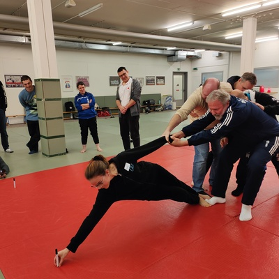
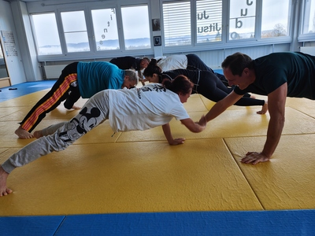

Unser Ziel: Gewaltpräventive Massnahmen in den regulären Trainings innerhalb von Kampfsporteinrichtungen zu integrieren, damit jedes Mitglied, egal welchen Alters und welcher Gurtstufe, die eigenen Grenzen klar kennt und allfällige Grenzverletzungen nicht tabuisiert, sondern angegangen werden. Damit Handlungsoptionen vorhanden sind, sowohl bei den Trainer:innen als auch bei den Trainierenden…

Der ConfidenceCoach ist eine Train-the-Trainer Weiterbildung für Trainer:innen von Kampfsportvereinen, die sich im Bereich der aktiven Gewaltprävention stärken möchten – ergänzend zum Kampfsport/Kampfkunst. Ziel ist es die teilnehmenden Trainer:innen in der aktiven Gewaltprävention zu schulen, sodass sie ihr Wissen im Trainingsalltag anwenden und vermitteln können. Durch die wiederholte Sensibilisierung der Kinder und Jugendlichen im Training, lassen sich Grenzverletzungen vermindern, werden frühzeitig benannt und/oder erkannt. Dadurch können Trainer:innen souverän in schwierigen Situationen reagieren, die Mitglieder und generell das Vertrauen in den Verein stärken.

**Kursort und Datum:** Kurse werden auf Nachfrage in eurem Dojo organisiert.

**Zielgruppe:** Für alle ab 15 Jahren aus dem Bereich Kampfkunst & Kampfsport & Selbstverteidigung, die Interesse an präventiven Ansätzen, Übungen und Spielen zur Gewaltvermeidung haben. Der Kurs ist verbandsoffen.

**Inhalte:**

1. Gewaltprävention für Trainer:innen und ihre Trainierenden.
2. Früherkennung und Intervention von Grenzverletzungen: was hilft?
3. Förderung emotionaler und sozialer Kompetenzen bei Kindern & Jugendlichen
4. Kommunikation und Körpersprache
5. Impulskontrolle und Selbstverantwortung
6. Gewalt versus regelkonforme Kämpfe
7. Leiterpersönlichkeit
8. Handlungsplan für den Fall einer Grenzverletzung oder Übergriff

**Kurskosten:** 150.– für ZJV-Mitglieder / 170.– für Nicht-Mitglieder (der Kurs ist verbandsoffen)

Weitere Informationen: [sjv.ch/confidence_coach](https://sjv.ch/confidence_coach)

Die Kursleitung: Katharina Eisenring, Expertin für Gewaltprävention und Selbstverteidigung IG Pallas, Tel 076 323 46 30 oder andere Pallas Kaderperson [www.pallas.ch](https://www.pallas.ch/)

[Flyer als PDF](2026-01-01-Ausschreibung-Werbung-Confidence-Coach-ZJV.pdf)
