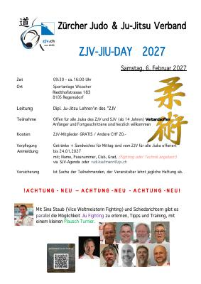

Samstag, 6. Februar 2027, 09:30 – ca. 16:00 Uhr, Sportanlage Wisacher, Riedthofstrasse 183, 8105 Regensdorf.

Offen für alle Jiuka des ZJV und SJV (ab 14 Jahren), verbandsoffen. Anfänger und Fortgeschrittene sind herzlich willkommen. Mit Sina Staub (Vize-Weltmeisterin Fighting) und Schiedsrichtern gibt es parallel die Möglichkeit, Jiu Fighting zu erlernen, mit Tipps, Training und einem kleinen Plausch-Turnier.

Anmeldung bis 24.01.2027 via SJV-Agenda oder [rudi.kaufmann@zjv.ch](mailto:rudi.kaufmann@zjv.ch).

