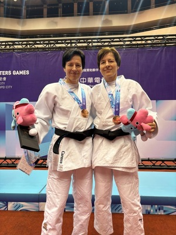
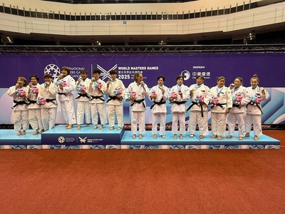

Nach dem Gewinn eines Paralympics-Diploms durch Carmen Brussig für die Schweiz in Paris erzielten die sehgeschädigten Zwillingsschwestern Carmen und Ramona Brussig aus dem Glarnerland auch bei den Judo World Masters Games 2025 in Taipeh herausragende Ergebnisse. Die 48-jährigen Judotrainerinnen vom Kampfsportcenter Do-Jigo Niederurnen/Wollerau holten insgesamt zwei Gold- und zwei Bronzemedaillen, indem sie in der Masterklasse der Normalsehenden antraten.

Carmen kämpfte in der Gewichtsklasse -52 kg, Ramona in der Klasse -57 kg, beide in der Alterskategorie F4 (45 bis 50 Jahre). Carmen, die sich nach einem dreifachen Beinbruch im Februar bewusst entschieden hatte, nicht an den IBSA-Weltmeisterschaften für Sehgeschädigte in Kasachstan teilzunehmen, nutzte die Zeit für gezieltes Techniktraining. Diese Vorbereitung zahlte sich aus: Carmen sicherte sich die Goldmedaille für die Schweiz, während Ramona für Deutschland die Goldmedaille holte.

Zusätzlich meldeten sich Carmen und Ramona, zusammen mit ihrer langjährigen Weggefährtin Romy Landinger aus Deutschland, auch für den Team-Wettbewerb der Damen an. In diesem Wettbewerb mussten drei Kämpferinnen – unabhängig von Nationalität oder Gewichtsklasse – ein Team bilden. Die drei Kämpferinnen traten gegen starke asiatische Teams an, die aus höhergewichtigen Athletinnen zusammengestellt wurden. Nach einer Niederlage im Halbfinale gegen die Mongolei kämpften sie im kleinen Finale um Platz drei gegen Japan. Es stand 1:1, als Carmen den letzten Kampf bestritt. Trotz der körperlichen Überlegenheit ihrer Gegnerin, die etwa 20 Kilogramm mehr wog, setzte Carmen auf ihre Technik und Erfahrung. Mit einem blitzschnellen Abtauchtechnik-Wurf sicherte sie dem Team die Bronzemedaille.

Die Leistung der Brussig-Zwillinge unterstreicht nicht nur ihre hohe Kompetenz als Judotrainerinnen, sondern auch ihre sportliche Entschlossenheit und Anpassungsfähigkeit in einem anspruchsvollen internationalen Wettkampf. Der Wettbewerb in Taipei markiert einen weiteren Höhepunkt in ihrer langen Karriere auf höchstem Niveau.
