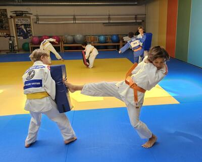
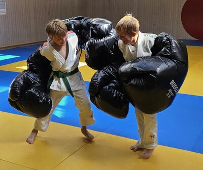
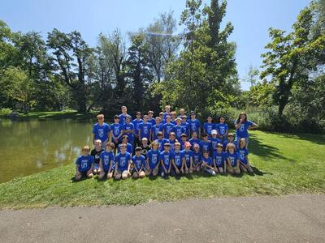

In der Woche vom 11. bis 15. August 2025 fand das Judo Sommercamp des Judo Club Uster statt, an dem 41 Kinder teilnahmen. Jeden Morgen wurde fleissig an Judotechniken gefeilt, im Fokus stand dieses Jahr Sode-tsurikomi-goshi. Zusätzlich brachten Denis Tomchuk und Masha Bulashevych aus der Ukraine ihr hohes technisches Können ein und zeigten den Kindern beeindruckende Spezialtechniken.

Die Nachmittage boten ein abwechslungsreiches Programm: Am Montag standen Ju Jutsu und Selbstverteidigung mit Kathrin auf dem Plan. Am Dienstag brachte Olaf Huber von Sypoba Uster mit seinen Stabilitäts- und Kraftübungen die Kinder ordentlich ins Schwitzen. Am Mittwoch ging es traditionsgemäss in die Dorfbadi Uster, bei strahlendem Sonnenschein wurde gebadet, Fussball gespielt und natürlich gab es für alle ein wohlverdientes Glace. Am Donnerstag trainierten die Kinder unter der Leitung von Lisa Gubler vom Leichtathletik Club Uster ihre Lauftechnik und Ausdauer.

Zum Abschluss wurde es am Freitag kreativ: Yukari Wakiyama führte in die Kunst der japanischen Kalligraphie ein, und die Kinder lernten, wie man Judo auf Japanisch schreibt. Ebenfalls am Freitag fanden drei Wettbewerbe statt: ein Reaktionsspiel mit Blaze Pods, die Hangman Challenge, bei der es darum ging, wer am längsten hängen kann, sowie ein Kalligraphie-Wettbewerb für den schönsten Schriftzug «Judo». Die Gewinner durften sich zuerst ein Geschenk aussuchen, am Ende ging jedoch kein Kind leer aus.

Es war eine sehr heisse und wunderschöne Woche voller Bewegung, Kultur, Freude und Fortschritte auf und neben der Tatami. Abschliessend wurde grosser Dank an alle Beteiligten ausgesprochen, insbesondere an die Trainer Philipp, Gian, Garik, Masha, Denis sowie Kathrin. Dank ihres Engagements und ihrer unermüdlichen Arbeit wurde das Camp für alle Kinder zu einem unvergesslichen Erlebnis, bei dem sie nicht nur ihre Judofähigkeiten erweitern, sondern auch viele neue Erfahrungen und Erlebnisse mit nach Hause nehmen konnten.

**Gian Kraus**

