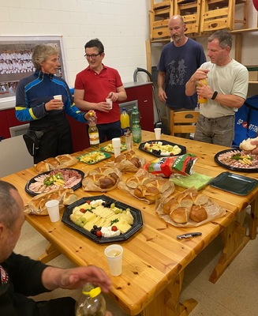
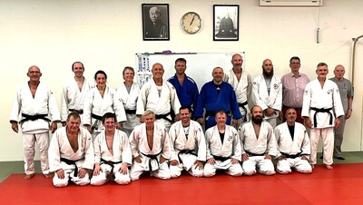

Am Samstag, 6. September 2025, fand das fünfte Veteranen-Treffen im Dojo des Judo Team Bülach statt. Ein grosses Dankeschön an das Judo Team Bülach für das kostenlos zur Verfügung gestellte Dojo. Ein besonderer Dank geht an den Zürcher Judo & Ju-Jitsu Verband ZJV (Kurt Nägeli), der uns am Ende des Trainings grosszügig einen Apéro spendiert hat.

An dieser dreistündigen Veranstaltung unter der Leitung von Gilbert Pantillon nahmen 17 Judokas teil, darunter zwei Frauen. Spass und gute Laune ist wie immer das Motto! Die Teilnehmenden treffen sich stets mit grossem Interesse auf den Tatamis, um Geselligkeit und Erfahrungsaustausch zu geniessen.

Nach dem Angrüssen und einigen Informationen zur Veteranen-Weltmeisterschaft in Paris mit über 2200 Anmeldungen sowie zu den nächsten Terminen im Jahr 2025 begann das Training mit einer Aufwärmphase, die auf Beweglichkeit, Kräftigung und Koordination ausgerichtet war. Der Schwerpunkt lag auf Bewegungen in alle Richtungen für die Arbeit im Stand. Nach 100 Uchi-Komi wurde der erste Trainingsteil im Stand mit Randoris gegen Mittag abgeschlossen.

Nach einer wohlverdienten Pause ging es in Kniestellung mit Umdrehungen in verschiedenen Varianten weiter, bevor das Training mit Randoris beendet wurde.

Dem Abgrüssen folgte ein Gruppenfoto, eine erfrischende Dusche und ein gemütlicher Apéro. Ein grosser Dank geht an alle Teilnehmenden sowie an Matthias Hunziker und Kurt Naegeli für ihre Unterstützung und ihr Engagement.

Nächste Veteranen-Aktivitäten:

- 20. September 2025 – Martigny (VS)
- 11. Oktober 2025 – Lugano (TI)
- 15. November 2025 – Petit-Lancy (GE)

