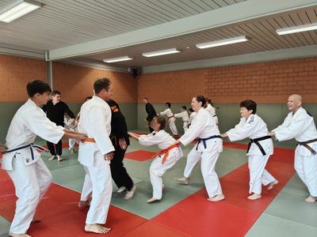
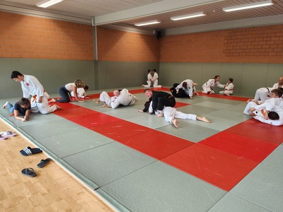
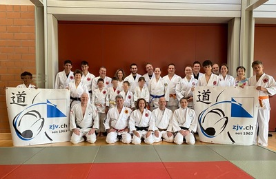

## Ein Wochenende voller Energie, Technik und Gemeinschaft

Das diesjährige ZJV-Weekend zeigte sich in einem ganz neuen Gewand. Auf dem Kerenzerberg oberhalb von Filzbach kamen Judo- und Ju-Jitsu-Begeisterte zusammen, um gemeinsam zu trainieren, Neues zu lernen und einfach eine gute Zeit zu haben. Während die budobegeisterten Kinder, Jugendlichen und Erwachsenen auf der Tatami ihr Können vertieften, genossen die Begleitpersonen eine gemütliche Wanderung mit traumhafter Aussicht auf den Walensee und die Glarner Alpen.

## Von Ashi-waza bis Kuchiki-daoshi – Technik mit Gefühl

Den Auftakt machte Werner Schuler (5. Dan Judo) mit Fusswurftechniken (Ashi-waza). Von De-ashi-barai bis Ko-uchi-gari führte er die Teilnehmenden Schritt für Schritt durch die Bewegungen – von einfachen Ansätzen über spannende Kombinationen bis hin zu Kontertechniken. Der Übergang in den Ju-Jitsu-Teil war fliessend: Die Wurftechnik Kuchiki-daoshi verband beide Disziplinen perfekt miteinander.

## Ju-Jitsu trifft Judo

Rudi Kaufmann (7. Dan Ju-Jitsu) zeigte, wie Kuchiki-daoshi im Ju-Jitsu eingesetzt werden kann und auch, dass Judo und Ju-Jitsu sich wunderbar ergänzen. Mit viel Erfahrung, Humor und Praxisnähe machte er den Teilnehmenden deutlich, wie beide Kampfkünste voneinander profitieren können.

## Training, Entspannung und mentale Stärke

Bevor es zum Abendessen ging, blieb Zeit zum Abschalten: Einige nutzten das Schwimm- und Sprudelbad, andere gönnten sich einfach eine Pause nach dem intensiven Training.

Am Abend übernahm Katharina Eisenring die Leitung. In ihrer Lektion kombinierte sie Selbstverteidigung nach Pallas mit Elementen aus dem Confidence Coaching. In Partner- und Gruppensituationen ging es um Impulskontrolle, Kommunikation, Selbstvertrauen, Körperbewusstsein und innere Stärke. Alles Themen, die auch abseits der Matte wertvoll sind.

## Vom Stand in den Boden – fliessende Übergänge

Am Sonntagmorgen leitete Werni Schuler erneut das Training und zeigte, wie man im Judo flüssig vom Stand in den Boden übergeht. Danach übernahm Rudi Kaufmann und erklärte, wie diese Übergänge, Festlege- und Kontrolltechniken im Ju-Jitsu aussehen. Sie zeigen, wie vielseitig und präzise die Kunst des Ju-Jitsu sein kann. Das neue Konzept der Budofamily kam bei allen richtig gut an. Man spürte den Zusammenhalt, die Freude am gemeinsamen Üben und das Interesse, über den eigenen Stil hinauszuschauen. Auch die Eltern der kleineren Kinder übten fleissig mit und genossen es, die Kinder in ihrem Sport zu erleben.

Nach einem Wochenende voller Energie, Begegnungen und neuer Impulse blickt der ZJV schon nach vorn: Das nächste ZJV-Weekend ist für den 21. + 22. November 2026 geplant und die Vorfreude ist jetzt schon gross!

