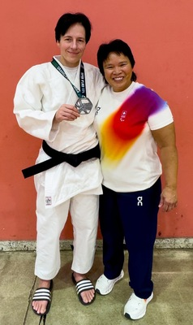
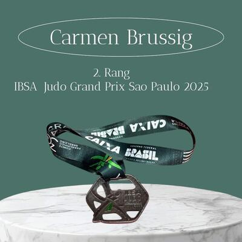

São Paulo IBSA-Judo-Grand-Prix 15.–16.12.2025: «Second Place, from Switzerland – Carmen Brussig» hallte es durch die Halle. Worte, die noch bei der Anreise kaum jemand erwartet hätte – am wenigsten wohl Carmen Brussig selbst.

Umso grösser war die Freude bei der Judoka aus dem Kampfsportcenter Do-Jigo und ihrem Coach Alexandra Schiesser.

Die Voraussetzungen waren alles andere als ideal. Nach einer schweren Verletzung kämpft Brussig noch immer mit einer langen Metallstange und mehreren Verschraubungen im rechten Standbein. Kraft und Stabilität sind dadurch eingeschränkt. Dennoch entschied sie sich, am IBSA-Judo-Grand-Prix in São Paulo zu starten – in der Hoffnung, vielleicht ein paar wichtige Weltranglistenpunkte zu sammeln. Was folgte, war eine beeindruckende Demonstration von Willenskraft und Kampfgeist.

---

**IBSA** – International Blind Sport Federation
