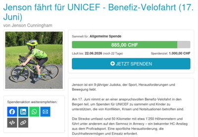

Jenson ist ein 9-jähriger Judoka, der Sport, Herausforderungen und Bewegung liebt.

Am 17. Juni nimmt er an einer anspruchsvollen Benefiz-Velofahrt in den Bergen teil, um Spenden für UNICEF zu sammeln und Kinder zu unterstützen, die von Konflikten, Krisen und Notsituationen betroffen sind. Weitere Informationen gibt es auf der UNICEF-Seite selbst (Klick auf das Vorschau-Bild):

