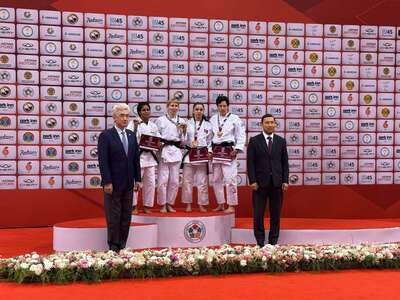
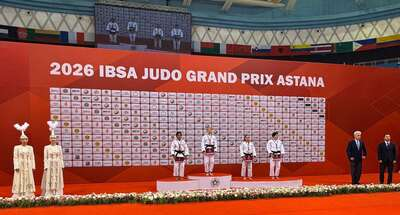
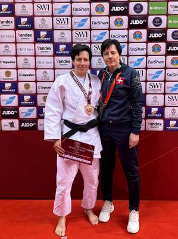

Im Zhaksylyk-Ushkempirov-Wrestling-Palast in Astana herrschte am ersten Wettkampftag des Grand Prix der International Blind Sports Federation eine elektrisierende Atmosphäre. Internationale Topathletinnen und -athleten, Paralympics-Medaillengewinner sowie Weltmeister kämpften am **12. Mai 2026** nicht nur um Edelmetall, sondern auch um wichtige Punkte für die Weltrangliste des internationalen Blinden-Sportverbands. Obwohl die offizielle Qualifikationsphase für die Paralympics 2028 in Los Angeles erst in wenigen Wochen beginnt, galt das Turnier in Kasachstan bereits als bedeutender Gradmesser.

**Carmen Brussig** aus Netstal erkämpfte sich in der Klasse J2/-52 kg eine bemerkenswerte **Bronzemedaille.** Ihr Start in Astana war wegen einer schweren Schulterverletzung nach dem letzten Wettkampf in Georgien im März lange ungewiss. Umso eindrücklicher und emotionaler war ihr Auftritt auf der grossen Bühne.

Im Viertelfinal agierte Brussig zunächst zurückhaltend. Die Inderin Kokila Kaushiklate nutzte dies und entschied den Kampf für sich. In der Repechage zeigte Brussig ihre mentale Stärke und steigerte sich. Im Duell mit der Brasilianerin Giovanna Rodrigues wurde sie zunächst mit zwei Verwarnungen belegt. Sie musste sich nun für das Risiko entscheiden. Ihr entschlossener Angriff brachte ihre Gegnerin mit einem schnellen Innenschenkelwurf flach auf den Rücken. Auch wenn der erhoffte Ippon nach einer kurzen Diskussion nicht gegeben wurde, blieb sie weiterhin fokussiert. Aufgrund der Schulterverletzung vermied sie Bodenaktionen und setzte konsequent auf Standkampf – mit Erfolg. Mit präzisen Angriffen sammelte sie weitere Wertungen und entschied den Kampf kurz vor Schluss mit einem zweiten Waza-ari.

Im Kampf um Bronze traf sie auf die Luxemburgerin Caecilia Riedel. Diese startete mit hohem Tempo, doch Brussig blieb ruhig und konterte im richtigen Moment zum ersten Waza-ari. Riedel musste offensiver werden, was Brussig erneut ausnutzte. Nur eine Minute später erzielte sie den zweiten Waza-ari und sicherte sich verdient die Bronzemedaille.

Für Carmen Brussig bedeutet diese Medaille mehr als ein Podestplatz. Nach schwierigen Wochen mit Verletzung, Operation und intensivem Wiederaufbau zahlte sich die harte Arbeit aus. Dass nun eine Medaille heraussprang, sorgte für grosse Freude im Schweizer Lager.

