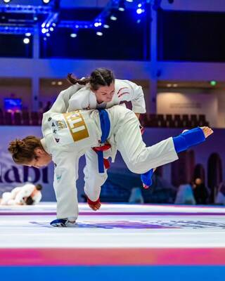
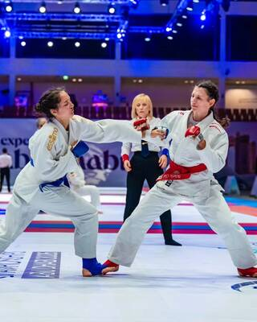
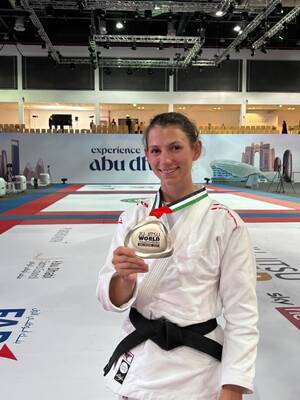
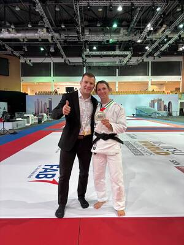

**Rütnerin erreicht als erste Schweizerin überhaupt ein WM-Finale im Ju-Jitsu Fighting**

**Wetzikon / Abu Dhabi –** Grosser Erfolg für Sina Staub und den Judo Club Wetzikon: Die Rütnerin hat sich an den Weltmeisterschaften in Abu Dhabi im **Ju-Jitsu Fighting** die Silbermedaille gesichert und darf sich Vize-Weltmeisterin nennen.

Doch die Medaille ist nicht der einzige Grund, weshalb dieser Erfolg in die Geschichte eingeht: **Sina Staub ist die erste Schweizerin überhaupt, die im Ju-Jitsu Fighting ein WM-Finale erreicht hat.**

Im Ju-Jitsu Fighting müssen die Athletinnen und Athleten in verschiedenen Kampfdistanzen überzeugen. Technik, Schnelligkeit, Kraft, Taktik und mentale Stärke sind entscheidend. Staub zeigte in Abu Dhabi starke Leistungen und kämpfte sich bis ins grosse Finale vor.

Dort traf sie auf eine Athletin aus der Ukraine. Trotz grossem Einsatz musste sie sich im Kampf um Gold geschlagen geben. Die Enttäuschung über das verpasste Gold dürfte jedoch schnell der Freude über das Erreichte gewichen sein: **Silber an der Weltmeisterschaft und damit Vize-Weltmeisterin.**

Für Staub ist es bereits die **vierte WM-Medaille** ihrer Karriere.

## Stolz beim Judo Club Wetzikon

Beim Judo Club Wetzikon ist die Freude über den historischen Erfolg entsprechend gross. «Wir sind unglaublich stolz auf Sina. Sie hat mit ihrem Einsatz, ihrer Disziplin und ihrer Leidenschaft gezeigt, was möglich ist», so der Verein.

Dass eine Athletin aus den Reihen des Judo Club Wetzikon auf der internationalen Bühne um WM-Gold kämpft, ist auch für den Verein eine besondere Auszeichnung.

Ihre Begeisterung für den Kampfsport gibt Staub zudem an die nächste Generation weiter. Sie steht regelmässig als Judo-Trainerin auf der Matte und engagiert sich im Nachwuchsbereich. Damit profitieren auch jüngere Sportlerinnen und Sportler von ihrer Erfahrung aus dem internationalen Spitzensport.

Mit dem WM-Finale in Abu Dhabi findet für Sina Staub gleichzeitig ein aussergewöhnlich erfolgreiches Wettkampfjahr seinen Höhepunkt. Nach zahlreichen Trainingsstunden, Wettkämpfen und Reisen rund um den Sport darf sie nun auf eine weitere WM-Medaille zurückblicken.

**Der Judo Club Wetzikon gratuliert Sina herzlich zum Vize-Weltmeistertitel und ist stolz, eine solche Athletin in seinen Reihen zu haben.**
